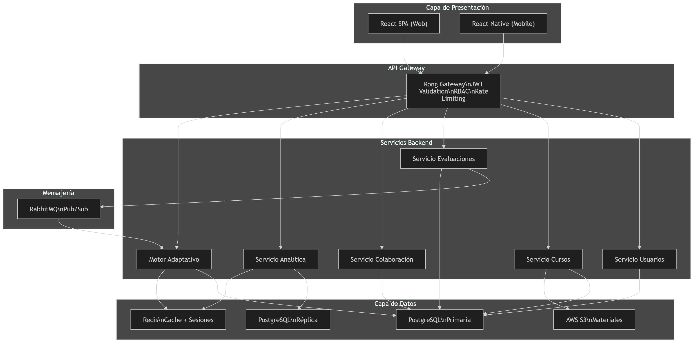
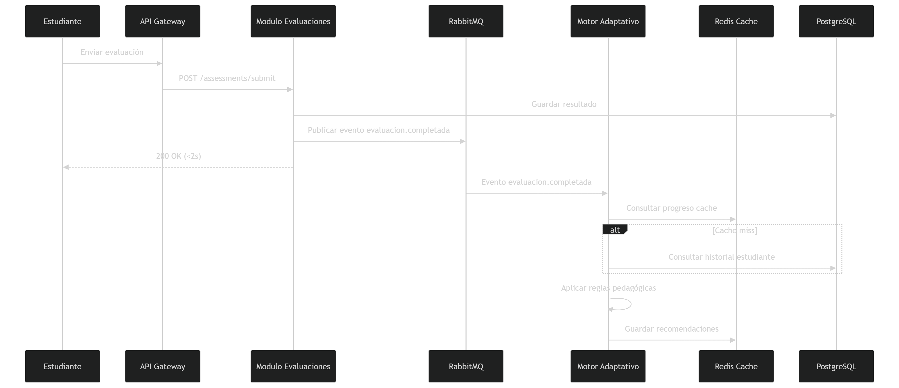
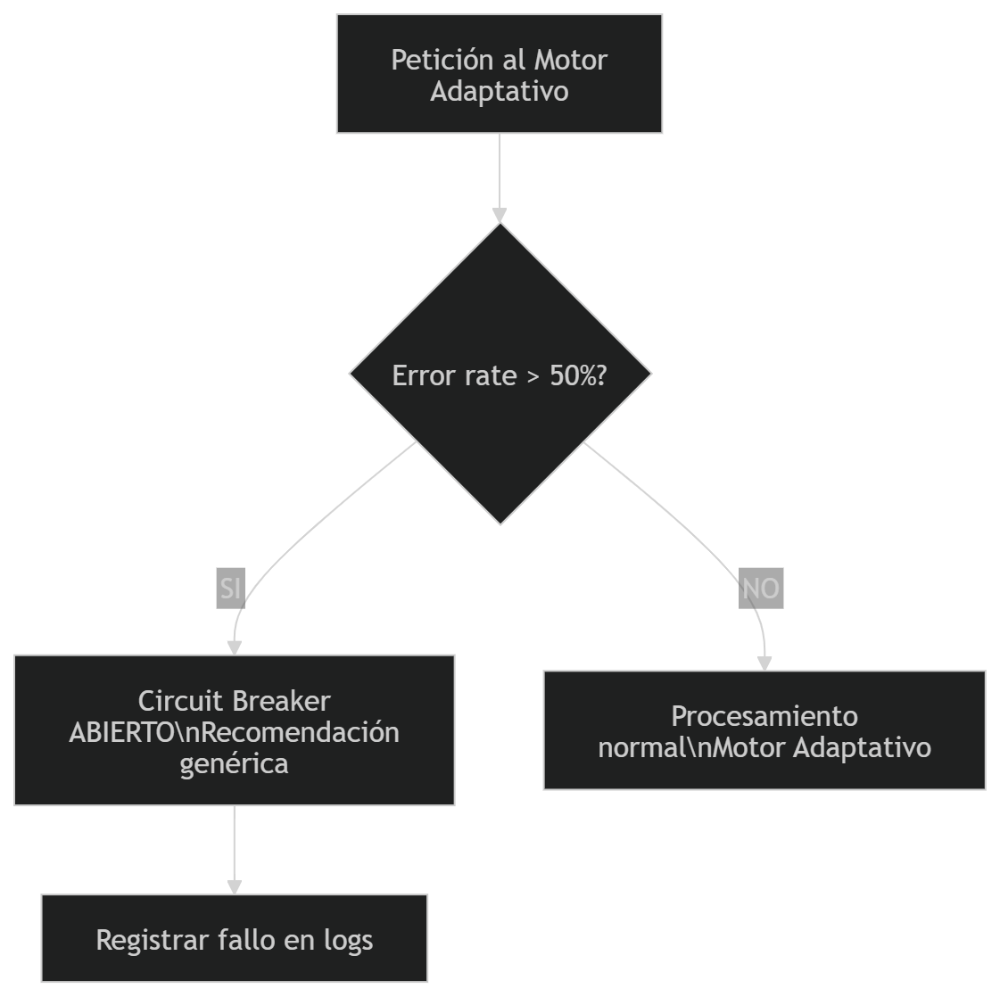
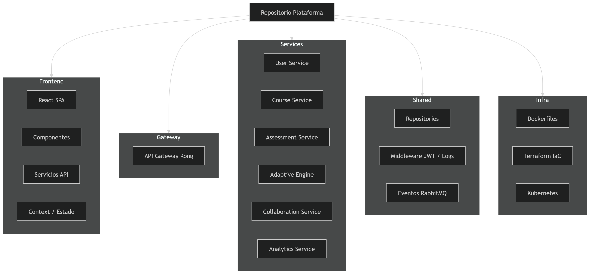
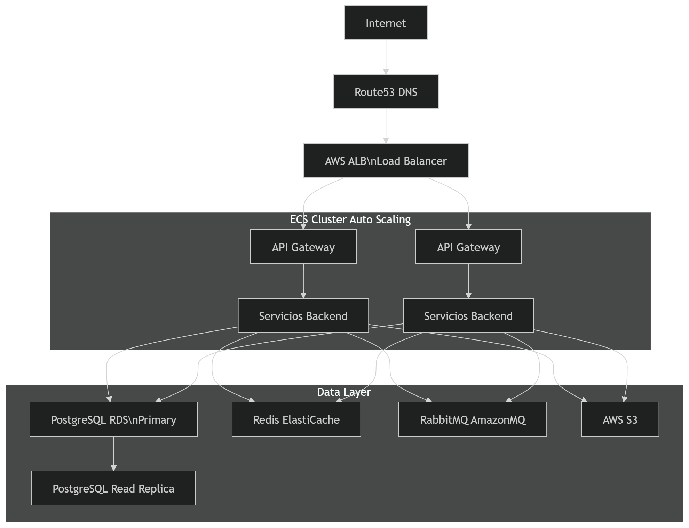
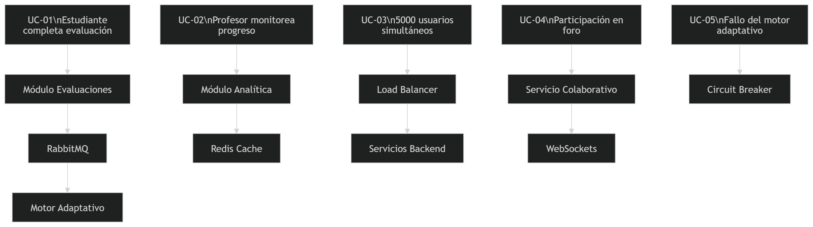

SOFTWARE ARCHITECTURE DOCUMENT (SAD)
Plataforma de Aprendizaje Adaptativo y Colaborativo
Pontificia Universidad Javeriana - Arquitectura de Software 2026
Version 1.0 | Marzo 2026

________________________________________
1. INTRODUCCION

1.1 Proposito
Este SAD describe la arquitectura de la Plataforma de Aprendizaje Adaptativo y Colaborativo. Esta dirigido a arquitectos, tech leads y desarrolladores senior. Sigue el modelo 4+1 Views (Kruchten, 1995) e incorpora ADRs. El SRS documenta el QUE; este SAD documenta el COMO y el POR QUE.

1.2 Alcance
Cubre drivers arquitectonicos, proceso ADD, patrones con justificacion, descripcion de componentes, las 5 vistas del modelo 4+1, ADRs y riesgos arquitectonicos.

1.3 Definiciones
Termino | Definicion
ADD | Attribute-Driven Design — metodo de diseno guiado por atributos de calidad
ADR | Architectural Decision Record — registro de una decision arquitectonica significativa
Motor Adaptativo | Componente que analiza desempeno del estudiante y personaliza el contenido
API Gateway | Punto unico de entrada que centraliza autenticacion, enrutamiento y rate limiting
RBAC | Role-Based Access Control — control de acceso basado en roles
JWT | JSON Web Token — estandar de autenticacion sin estado

________________________________________
2. DRIVERS ARQUITECTONICOS

2.1 Stakeholders y preocupaciones
Stakeholder | Preocupaciones arquitectonicas principales
Estudiantes | Rendimiento (<2s), disponibilidad 24/7, contenido personalizado
Profesores | Analitica de progreso, gestion de cursos, reportes
Administradores | Seguridad, control de acceso por roles, escalabilidad
Equipo de desarrollo | Mantenibilidad, modularidad, bajo acoplamiento
DevOps / Operaciones | Disponibilidad 99.5%, escalamiento horizontal, monitoreo

2.2 Atributos de Calidad — Escenarios Medibles
ID | Atributo | Escenario | Metrica
RNF-01 | Escalabilidad | Miles de usuarios acceden simultaneamente al inicio del semestre | >5.000 usuarios concurrentes sin degradacion
RNF-02 | Disponibilidad | La plataforma opera continuamente, incluso en mantenimientos | 99.5% uptime mensual (~3.6h downtime/mes)
RNF-03 | Rendimiento | Un estudiante carga su curso o envia una evaluacion | <2 segundos en percentil 95
RNF-04 | Seguridad | Un usuario intenta acceder a recursos de otro usuario o rol diferente | Autenticacion JWT + RBAC. Acceso denegado con log de auditoria
RNF-05 | Mantenibilidad | El equipo incorpora un nuevo modulo (ej. gamificacion) | Despliegue sin afectar modulos existentes
RNF-06 | Interoperabilidad | Integracion futura con Moodle u otro LMS externo | APIs REST con OpenAPI 3.0, soporte OAuth 2.0

2.3 Restricciones
- Infraestructura desplegada en cloud (AWS) para escalabilidad elastica.
- Comunicacion exclusivamente sobre HTTPS.
- Base de datos con soporte transaccional ACID para evaluaciones.
- Cumplimiento con normativas de proteccion de datos personales.

________________________________________
3. PROCESO DE DISENO ARQUITECTONICO (ADD)

Se aplico el metodo Attribute-Driven Design (ADD) de forma iterativa.

3.1 Iteracion 1 — Estructura General del Sistema
Drivers: RNF-01 Escalabilidad, RNF-05 Mantenibilidad
Decision: Arquitectura en capas + modulos de servicio + API Gateway centralizado. Justificacion: escalar cada modulo de forma independiente y modificar uno sin afectar los demas.

3.2 Iteracion 2 — Motor Adaptativo (Elemento de Mayor Riesgo)
Drivers: RNF-03 Rendimiento, RNF-01 Escalabilidad
Sub-componente | Responsabilidad | Tactica aplicada
Analizador de Desempeno | Calcula indicadores de progreso por estudiante | Cache en Redis para resultados recientes (TTL 5 min)
Motor de Reglas | Aplica reglas pedagogicas para determinar siguiente contenido | Procesamiento asincrono via RabbitMQ
Recomendador de Contenido | Selecciona materiales de refuerzo o avanzados | Indice pre-computado para recomendaciones en <500ms
Decision: El flujo de adaptacion es asincrono. El modulo de Evaluaciones publica evento; el Motor Adaptativo lo consume sin bloquear la respuesta al estudiante.

3.3 Iteracion 3 — Disponibilidad y Seguridad
Drivers: RNF-02 Disponibilidad, RNF-04 Seguridad
Tactica | Mecanismo | Driver
Redundancia activa | Multiples instancias detras de ALB con auto-scaling | RNF-02
Health checks | ALB remueve instancias fallidas en <30s | RNF-02
JWT stateless | Tokens 1h. Refresh tokens en Redis con rotacion | RNF-04
RBAC | Roles: Estudiante, Profesor, Administrador en API Gateway | RNF-04
Replica de lectura BD | Escrituras en primaria, lecturas en replica | RNF-02, RNF-03
Circuit Breaker | Si falla Motor Adaptativo, responde generico | RNF-02

3.4 Iteracion 4 — Interoperabilidad
Driver: RNF-06
Decision: Capa de API publica con OpenAPI 3.0 y soporte OAuth 2.0 para integraciones futuras (Moodle, Canvas, Coursera) sin modificar arquitectura interna.

________________________________________
4. PATRONES ARQUITECTONICOS Y CUMPLIMIENTO DE ATRIBUTOS

Patron | Problema que resuelve | Solucion en la plataforma | Atributos satisfechos
Layered Architecture | Alto acoplamiento entre presentacion, logica y datos | Capas: React SPA -> API Gateway -> Servicios -> BD | RNF-05, RNF-01
API Gateway | Logica de seguridad duplicada en cada servicio | Kong centraliza JWT, RBAC y rate limiting | RNF-04, RNF-05
Repository Pattern | Acoplamiento directo con motor de BD | Cada modulo accede via su repositorio | RNF-05, RNF-06
Cache-Aside (Redis) | Consultas frecuentes saturan BD | Redis almacena progreso y recomendaciones (TTL 5 min) | RNF-03, RNF-01
Pub/Sub (RabbitMQ) | Procesamiento adaptativo no debe bloquear | Evento evaluacion.completada consumido asincronamente | RNF-03, RNF-01
Circuit Breaker | Falla en Motor Adaptativo en cascada | Si error rate >50% abre circuito y responde degradado | RNF-02
MVC en Frontend | Mezcla de presentacion con negocio | React + Context API separa vistas y estado | RNF-05

________________________________________
5. DESCRIPCION DE COMPONENTES

5.1 API Gateway
- Responsabilidad: Punto unico de entrada. Valida JWT, aplica RBAC, enruta y rate limiting (100 req/min usuario).
- Tecnologia: Kong en Docker.
- Interfaces: REST HTTPS:443. OpenAPI 3.0.
- Dependencias: Usuarios (validacion de tokens), Redis (rate limit counters).
- Atributos: RNF-04, RNF-05, RNF-06.

5.2 Modulo de Gestion de Usuarios
- Responsabilidad: Registro, autenticacion y roles.
- Tecnologia: Node.js + Express. PostgreSQL (users, roles). Redis (refresh tokens, TTL 7 dias).
- Interfaces: POST /auth/register, POST /auth/login, POST /auth/refresh, GET /users/{id}, PUT /users/{id}.
- Dependencias: PostgreSQL, Redis.
- Atributos: RNF-04, RNF-02.

5.3 Modulo de Gestion de Cursos
- Responsabilidad: Cursos, modulos, materiales, inscripciones.
- Tecnologia: Node.js + Express. PostgreSQL. AWS S3 (materiales).
- Interfaces: CRUD /courses, /courses/{id}/modules, /courses/{id}/enroll, GET /courses/{id}/materials.
- Dependencias: Usuarios (roles), S3, PostgreSQL.
- Atributos: RNF-01, RNF-05.

5.4 Modulo de Evaluaciones
- Responsabilidad: Creacion y envio de evaluaciones, registro de resultados ACID.
- Tecnologia: Node.js + Express. PostgreSQL transaccional.
- Interfaces: POST /assessments, POST /assessments/{id}/submit, GET /assessments/{id}/results.
- Dependencias: PostgreSQL, RabbitMQ (publica evaluacion.completada), Cursos.
- Atributos: RNF-03, RNF-04.

5.5 Motor Adaptativo
- Responsabilidad: Consume eventos de evaluaciones, analiza desempeno, aplica reglas y actualiza recomendaciones.
- Tecnologia: Node.js. Redis (cache de progreso y recomendaciones). PostgreSQL (historial).
- Interfaces: Consumidor RabbitMQ (evaluacion.completada). GET /adaptive/recommendations/{studentId}.
- Dependencias: RabbitMQ, Redis, PostgreSQL, Cursos.
- Atributos: RNF-01, RNF-03.

5.6 Modulo Colaborativo
- Responsabilidad: Foros, grupos, chat y actividades colaborativas.
- Tecnologia: Node.js + Express. WebSockets (Socket.io). PostgreSQL.
- Interfaces: GET/POST /forums/{courseId}/threads, POST /groups, GET /groups/{id}/members, WebSocket /ws/chat.
- Dependencias: Usuarios, Cursos, PostgreSQL.
- Atributos: RNF-01, RNF-03.

5.7 Modulo de Analitica
- Responsabilidad: Dashboards de progreso y reportes.
- Tecnologia: Node.js + Express. Consultas agregadas sobre PostgreSQL. Cache en Redis.
- Interfaces: GET /analytics/courses/{id}/progress, GET /analytics/courses/{id}/difficulties, GET /analytics/students/{id}/report.
- Dependencias: PostgreSQL (replica de lectura), Redis.
- Atributos: RNF-03, RNF-05.

________________________________________
6. VISTAS ARQUITECTONICAS 4+1

6.1 Vista de Escenarios (+1)
ID | Escenario | Componentes
UC-01 | Estudiante completa evaluacion y recibe contenido adaptado | Evaluaciones -> RabbitMQ -> Motor Adaptativo -> Redis -> Frontend
UC-02 | Profesor monitorea progreso en tiempo real | Analitica -> PostgreSQL replica -> Redis -> Frontend
UC-03 | 5.000 estudiantes acceden simultaneamente | ALB -> Auto-scaling -> API Gateway -> Modulos -> PostgreSQL + Redis
UC-04 | Estudiante participa en foro | Colaborativo -> WebSockets -> PostgreSQL
UC-05 | Sistema detecta fallo en Motor Adaptativo | Circuit Breaker -> Respuesta degradada -> Log auditoria

6.2 Vista Logica
- Todos los modulos reciben peticiones via API Gateway.
- Evaluaciones publica eventos a RabbitMQ; Motor Adaptativo consume.
- Analitica lee de replica de PostgreSQL.
- Redis compartido por Motor Adaptativo (recomendaciones) y Analitica (dashboards).

6.3 Vista de Procesos
Proceso UC-01 — Flujo de adaptacion: API Gateway -> Evaluaciones -> RabbitMQ -> Motor Adaptativo -> Redis -> Web App.
Proceso UC-05 — Circuit Breaker: Gateway/servicio detecta falla, abre circuito, responde generico y loguea.

6.4 Vista de Desarrollo
- Cada servicio independiente con su propio package.json y Dockerfile.
- Repositorios compartidos en /shared para evitar duplicacion.
- Infraestructura versionada como codigo (IaC).

6.5 Vista Fisica (Despliegue)
- Servicios en AWS ECS con auto-scaling (CPU >70%, latencia >1.5s). Minimo 2 instancias por servicio para 99.5% disponibilidad.
- ALB frente al API Gateway. PostgreSQL primaria + replica de lectura. Redis (ElastiCache). RabbitMQ (Amazon MQ). S3 para materiales.

6.6 Escenarios Arquitectonicos
- Rendimiento: p95 <2s consultas de curso/evaluacion.
- Seguridad: JWT + RBAC en gateway, todo trafico HTTPS.
- Resiliencia: Circuit breaker y reintentos con DLQ.

6.7 Diagramas
- Diagramas Mermaid y PNG/SVG exportados en [diagrams/README.md](diagrams/README.md). Imagenes directas:
	- Contenedores: [diagrams/img/containers.png](diagrams/img/containers.png)
	- Secuencia UC-01: [diagrams/img/uc01-secuencia.png](diagrams/img/uc01-secuencia.png)
	- Circuit Breaker: [diagrams/img/circuit-breaker.png](diagrams/img/circuit-breaker.png)
	- Desarrollo: [diagrams/img/desarrollo.png](diagrams/img/desarrollo.png)
	- Despliegue: [diagrams/img/despliegue.png](diagrams/img/despliegue.png)
	- Escenarios (+1): [diagrams/img/escenarios.png](diagrams/img/escenarios.png)

________________________________________
7. ARCHITECTURAL DECISION RECORDS (ADRs)

- ADR-001: Arquitectura en Capas con Modulos de Servicio
- ADR-002: API Gateway como Punto Unico de Entrada
- ADR-003: Procesamiento Asincrono del Motor Adaptativo con RabbitMQ
- ADR-004: PostgreSQL como Base de Datos Principal con Replica de Lectura

________________________________________
8. RIESGOS ARQUITECTONICOS

ID | Riesgo | Probabilidad | Impacto | Mitigacion
R-01 | Pico de usuarios supera capacidad | Media | Alto | Auto-scaling en ECS, pruebas de carga previas.
R-02 | Complejidad del Motor Adaptativo retrasa entregas | Alta | Medio | Desarrollo incremental, circuit breaker.
R-03 | Latencia de replicacion afecta analitica | Baja | Bajo | Comunicar retraso max 5 min, cache Redis 5 min.
R-04 | RabbitMQ punto unico de fallo | Baja | Alto | AmazonMQ HA, DLQ y reintentos.
R-05 | Integracion con LMS externos compleja | Media | Medio | OpenAPI 3.0 y OAuth 2.0 desde inicio.

________________________________________
9. TECNOLOGIAS Y JUSTIFICACION

Capa | Tecnologia | Justificacion
Frontend | React 18 + TypeScript | Componentes reutilizables, tipado estatico.
API Gateway | Kong | Plugins JWT/RBAC/rate limiting, portable.
Backend | Node.js 20 + Express | IO no bloqueante, mismo lenguaje front/back.
Base de datos | PostgreSQL 16 (AWS RDS) | ACID, replica de lectura gestionada.
Cache | Redis 7 (ElastiCache) | Latencia baja, TTL nativo.
Mensajeria | RabbitMQ (Amazon MQ) | Pub/Sub confiable, DLQ.
Almacenamiento | AWS S3 | Materiales con alta durabilidad.
Contenedores | Docker + AWS ECS | Despliegue consistente, auto-scaling.
IaC | Terraform | Infraestructura versionada.

________________________________________
10. CONCLUSION

La arquitectura combina estructura en capas y modulos de servicio que escalan y evolucionan de forma independiente. Las decisiones criticas (API Gateway, procesamiento asincrono y replica de lectura) trazan directamente a los atributos RNF-01..06. Las vistas 4+1 permiten a cada stakeholder entender el sistema desde su perspectiva.

________________________________________
SAD v1.0 — Plataforma de Aprendizaje Adaptativo y Colaborativo — PUJ 2026
