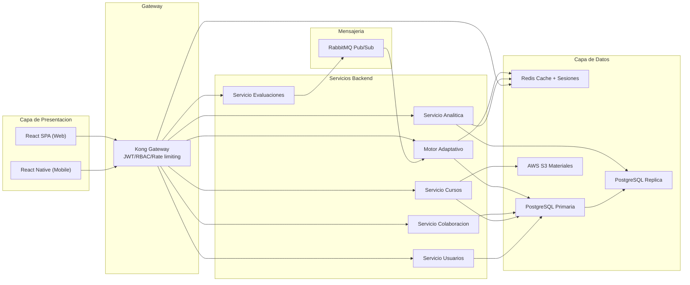
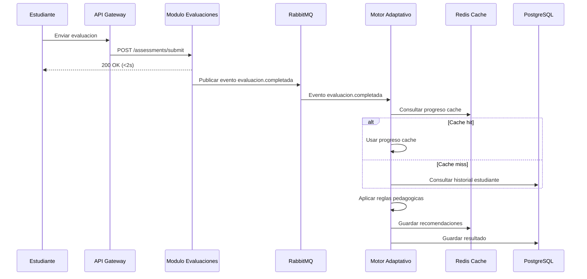
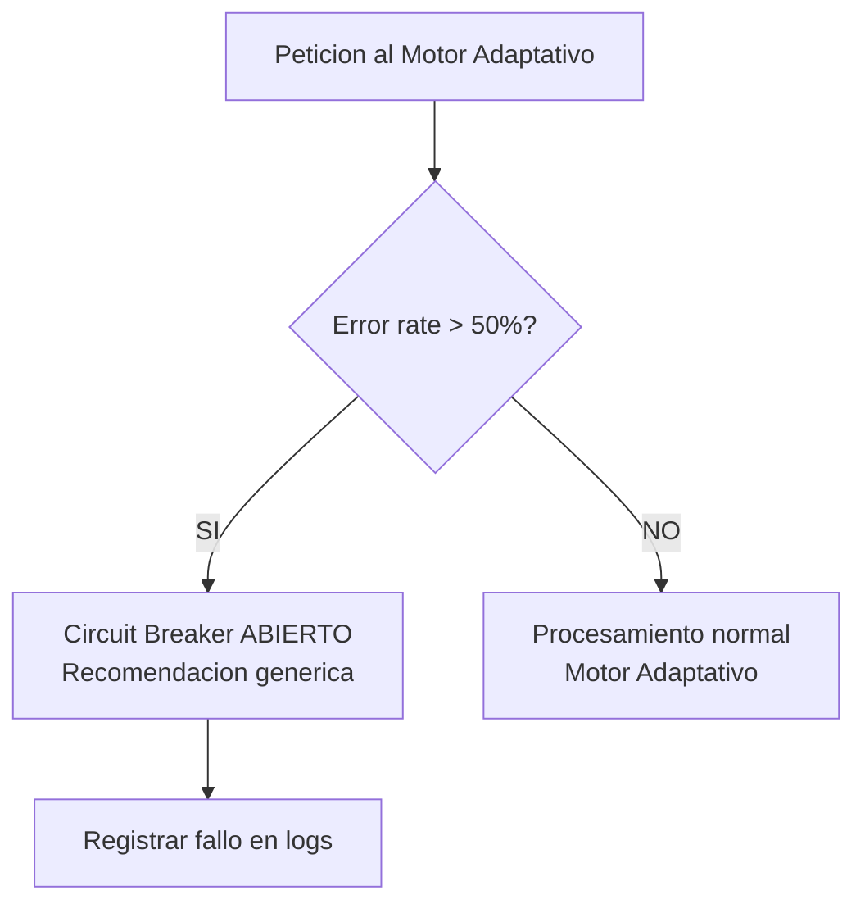
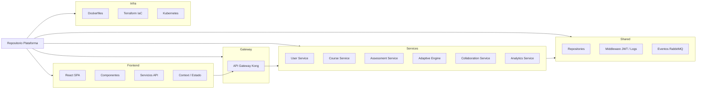
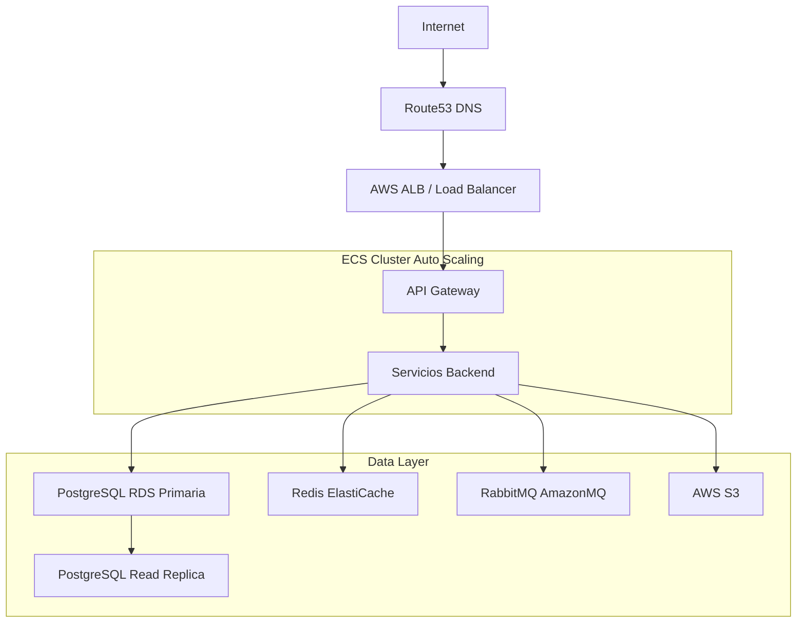
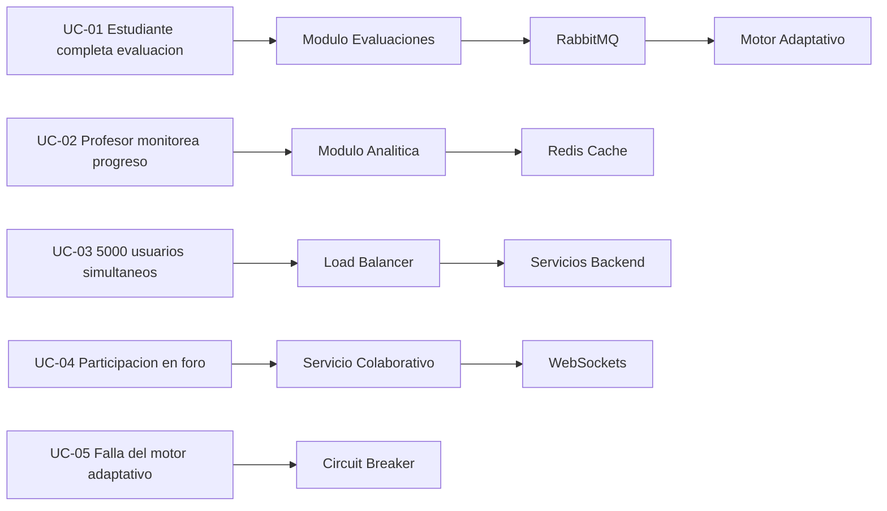

# Diagramas de Arquitectura

Este directorio contiene diagramas en Mermaid alineados con el SAD v1.0. Renderizar en cualquier visor compatible con Mermaid.

## Vista de Contenedores (C4 nivel contenedor)
Imagen: [img/containers.png](img/containers.png)
Mermaid base:

## Secuencia UC-01 (evaluacion.completada)
Imagen: [img/uc01-secuencia.png](img/uc01-secuencia.png)
  Mermaid base:

## Circuit Breaker (Motor Adaptativo)
Imagen: [img/circuit-breaker.png](img/circuit-breaker.png)
Mermaid base:

## Vista de Desarrollo (organizacion del repo)
Imagen: [img/desarrollo.png](img/desarrollo.png)
Mermaid base:

## Vista de Despliegue (alto nivel)
Imagen: [img/despliegue.png](img/despliegue.png)
Mermaid base:

## Escenarios (+1)
Imagen: [img/escenarios.png](img/escenarios.png)
Mermaid base:

